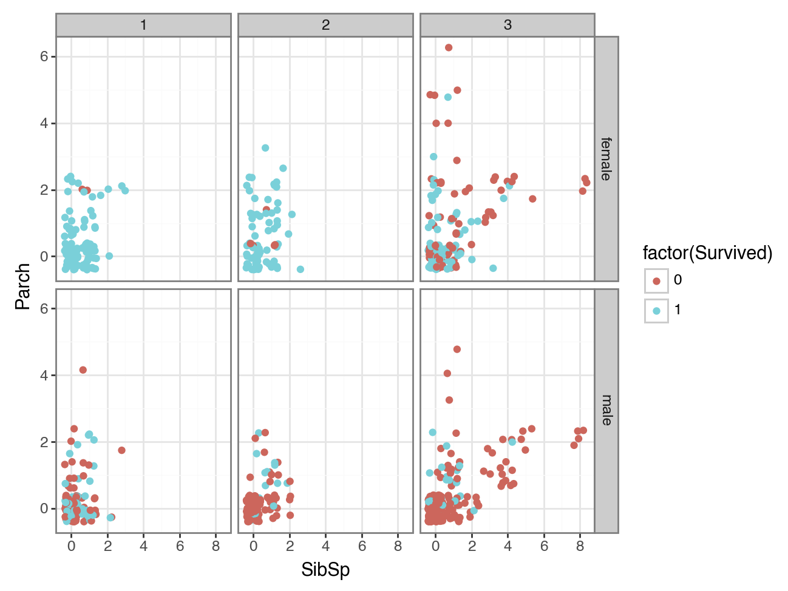
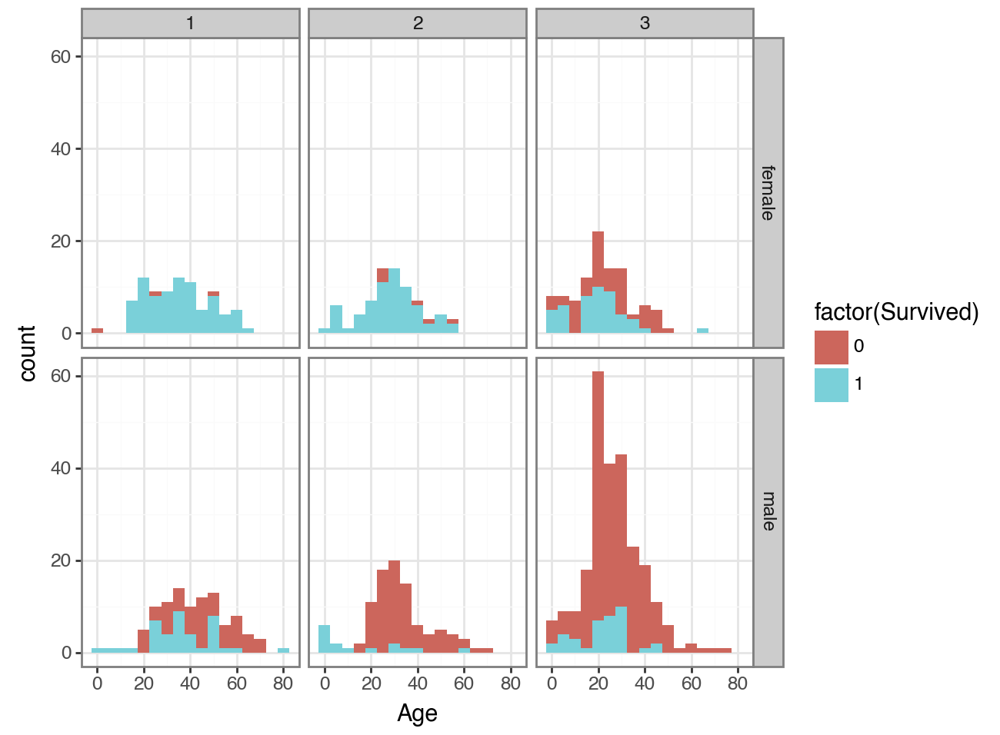
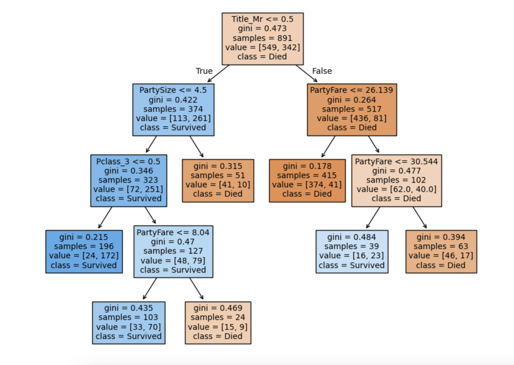
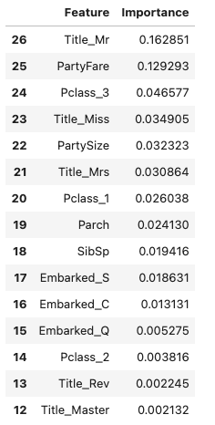
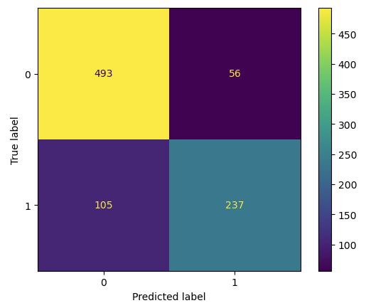

# ML Approach w/ Titanic Dataset in Python

## Executive Summary:

Yes, the Titanic Dataset is a ginormous cliche in the data science world!  However, it has earned that cliche status by being a dataset (and story!) that is well-understood by almost everyone.  As such, it is an excellent dataset to use to illustrate my ML Approach.  By choosing to use this dataset, the focus of this repository can be on understanding my ML problem-solving approach and not on understanding a new, complicated, or industry-specific dataset.  

I have broken my ML approach into the Methodology listed below.  Each step of the Methodology has its own separate .ipynb file with my approach, code, and occasional comments about my process and learnings.  Please take these in order.  

Decision trees are one of my all-time favorite ML models to use.  They work very well for a majority of predictive business problems regardless of the industry.  Also, their "if this then that" path through the tree makes intuitive sense and is easy for individuals of all levels of ML literacy to understand.  A model that works well and is easy to explain to stakeholders checks two important boxes!  

### Problem: 

Build a Decision Tree and Random Forest model to predict the likelihood of "Died or Survived" on the Titanic. Compare the strength of the two models and select which is best.       

### Methodology & Skills: 

1. Exploratory Data Analysis (EDA): Profile dataset, Visualize data, Visualize feature interactions

Example EDA Visualizations:

   
2. Decision Tree Build: Engineer features, Replace null values, Impute missing ages, Add calculated fields, Encode features, Build data frames, Tune model, Visualize model, Evaluate Bias and Variance

Decision Tree: 

3. Random Forest Build: Engineer features, Encode features, Build data frames, Feature importance, Feature cleanup, Train model, Best hyperparameters, Evaluate OOB, Test model, Export CSV 

Top 15 Features: 

Confusion Matrix: 

4. Compare Models: Select best

### In Repository: 
Titanic Test CSV file
Titanic Train CSV file
.pynb files for each Methodology #1-3 listed above
